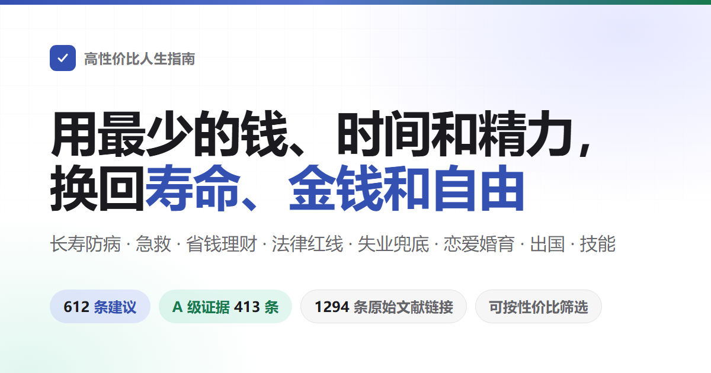

<div align="center">



# 高性价比人生指南

讲怎么活得久、怎么少生病，出了意外怎么救。讲怎么少花冤枉钱，哪些事会让人被骗、摊上官司。讲没工作没钱时能去领什么，开店、开公司、做网站要办什么手续。也讲恋爱结婚生孩子、出国和学手艺。<br>
612 条建议，每条写明花掉什么、换回什么、证据有多硬，来源只引期刊论文和官方文件。

不用全做：这是按性价比排好的备选单，不是任务清单——挑走一两条就算数，作者自己也没做到其中大部分。

[](https://eternity4719.github.io/HowToLiveBetter/)
[](#目录)
[](#证据分级)
[](docs/核实记录/)
[](LICENSE)

**[打开在线检索页](https://eternity4719.github.io/HowToLiveBetter/)** · [下载 PDF](https://github.com/eternity4719/HowToLiveBetter/releases/download/epub-latest/HowToLiveBetter.pdf) · [下载 EPUB](https://github.com/eternity4719/HowToLiveBetter/releases/download/epub-latest/HowToLiveBetter.epub) · [下载离线单文件（HTML）](https://github.com/eternity4719/HowToLiveBetter/releases/download/epub-latest/HowToLiveBetter.html) · [目录](#目录) · [术语表](#读懂数字术语表) · [核实记录](docs/核实记录/) · [结婚划不划算（长文）](docs/结婚划不划算.md) · [家庭应急装备清单（长文）](docs/家庭应急装备清单.md) · [遇到陌生人出事该不该停（长文）](docs/遇到陌生人出事该不该停.md) · [做平台要办哪些证（长文）](docs/做平台要办哪些证.md) · [生物钟和夜班（长文）](docs/生物钟和夜班.md)

其他语言：[English](https://dlgrv.github.io/HowToLiveBetter/en/) · [Русский](https://dlgrv.github.io/HowToLiveBetter/ru/) · [Español](https://dlgrv.github.io/HowToLiveBetter/es/) —— 由 [dlgrv](https://github.com/dlgrv) 维护的非官方翻译（[仓库](https://github.com/dlgrv/HowToLiveBetter)），译文按翻译当时的中文正文做，之后新增和改动的条目不一定跟上，一切以本仓库的中文原文为准。

</div>

---

## 这本书想回答的问题

| 问题 | 去哪看 |
| --- | --- |
| 几乎不花钱，就能明显降低早死概率的事有哪些？ | [1. 不要早死](book/01-不要早死.md) |
| 抽烟、喝酒、久坐、熬夜到底折寿多少，烟和酒具体怎么戒？ | [2. 不要慢慢死](book/02-不要慢慢死.md) |
| 每天精力不够用、总被打断，怎么改？ | [3. 不要浪费精力](book/03-不要浪费精力.md) |
| 时间都花哪去了，怎么少做无收益的事，拖延怎么治？ | [4. 不要浪费时间](book/04-不要浪费时间.md) |
| 攒下的钱该怎么放，才不被利息、费率和骗局吃掉？ | [5. 不要浪费钱](book/05-不要浪费钱.md) |
| 哪些保健品、体检套餐、智商税可以直接不买？ | [6. 反面清单](book/06-反面清单.md) |
| 失业了、被欠薪了、身上没钱了，能领什么、去哪求助？ | [7. 没钱的时候怎么活](book/07-没钱的时候怎么活.md) |
| 彩礼、婚前房产、恋爱期间的大额转账算谁的，被人报案指控或捏造事实举报时第一步做什么，自己惹了事主动去说能减多少刑，事后能不能追究和索赔？ | [8. 法律与财产安全](book/08-别把自己搭进去.md) |
| 哪些「兼职」和顺手的小事会让普通人变成刑事被告？ | [9. 普通人容易踩的法律红线](book/09-普通人容易踩的法律红线.md) |
| 追人该广撒网还是死磕一个，异地恋能不能成，领证要带什么？ | [10. 恋爱和结婚划不划算](book/10-恋爱和结婚划不划算.md) |
| 写哪些代码、接哪些单会被判刑？ | [11. 程序员和技术人容易踩的红线](book/11-程序员和技术人容易踩的红线.md) |
| 借钱开店、开公司之前最该先想清楚什么？ | [12. 创业与做生意](book/12-创业与做生意.md) |
| 有人倒地没了呼吸、大出血、火灾、迷路，先做什么？ | [13. 紧急情况：先做什么](book/13-紧急情况.md) |
| 账号被盗、手机丢了，第一步做什么？ | [14. 账号与信息安全](book/14-账号与信息安全.md) |
| 押金被扣、房东赶人、长租公寓暴雷怎么办？ | [15. 租房与买房](book/15-租房与买房.md) |
| 确诊慢性病之后，长期该怎么管、怎么少花钱？ | [16. 得了慢性病之后怎么活](book/16-得了慢性病之后怎么活.md) |
| 老人的监护、遗嘱和钱该怎么提前安排？ | [17. 家里有老人](book/17-家里有老人.md) |
| 生孩子能领什么、要占掉多少时间和钱？ | [18. 养孩子划不划算](book/18-养孩子划不划算.md) |
| 加班费、年休假该怎么算，被裁该拿多少补偿，上班受了伤怎么认定和拿钱？ | [19. 在职、离职和工伤](book/19-在职离职和工伤.md) |
| 孩子刚出生，最要紧的几件事是什么？ | [20. 刚出生的孩子怎么带](book/20-刚出生的孩子怎么带.md) |
| 哪些国家现在别去，出事了使领馆管到哪一步？ | [21. 出国、旅行与境外安全](book/21-出国旅行与境外安全.md) |
| 去 KTV、网吧、密室怎么不踩坑，压力大时做什么最有用？ | [22. 怎么放松：娱乐场所和减压](book/22-怎么放松.md) |
| 学电焊、学英语、考证，哪些真的回本，怎么学才省时间，职称从哪里报、值不值？ | [23. 学什么技能划算](book/23-学什么技能划算.md) |
| 同一个病在社区看和在三级医院看差多少钱，伤得很重时是挂号排队还是找急诊分诊台，治完要不要做伤残鉴定、办残疾人证？ | [24. 看病：怎么少花钱少走弯路](book/24-看病.md) |
| 家里人走了，当时先做什么、哪些钱能取回来、哪些费用可以不交？ | [25. 人走了以后要办什么](book/25-人走了以后要办什么.md) |
| 做个网站或平台收钱，要办哪些证、服务器放哪？ | [26. 做一个网站或平台](book/26-做一个网站或平台.md) |
| 怀孕了、要生了，什么时候做什么，出院前要办哪些证？ | [27. 怀孕和生产](book/27-怀孕和生产.md) |
| 想减肥、想变好看，哪些做法会把身体搞坏？ | [28. 别为了外形把身体搞坏](book/28-别为了外形把身体搞坏.md) |
| 亲人走了、被裁了、拿到重病诊断，头几个月最要紧的是什么？ | [29. 遭遇重大打击之后](book/29-遭遇重大打击之后.md) |
| 孩子上学以后，哪些身体和心理的事不能等到考完再说？ | [30. 上学以后的孩子](book/30-上学以后的孩子.md) |
| 十八岁之后除了读书和打工还有哪几条路，各自的门槛是什么？ | [31. 十八岁之后有哪几条路](book/31-十八岁之后有哪几条路.md) |
| 出国留学，签证身份怎么才算没断，回国这张文凭认不认？ | [32. 出国留学：身份、打工、保险和回国认证](book/32-出国留学.md) |
| 自己或者家人残疾了，先防住哪些并发症，能申请哪些补贴，上学就业和监护怎么办？ | [33. 残疾之后怎么活](book/33-残疾之后怎么活.md) |

## 怎么读

- **不用全做**：这是一份按性价比排好的备选单，不是任务清单。挑走一两条就算数，剩下的放着，需要时再回来查。「说着容易做着难」这个评价是对的——作者自己也没做到其中大部分，写下来是为了要用的时候找得到。想挑省力的，看下面「只想看最值得做的」那条。
- **想按条件挑**：打开[在线检索页](https://eternity4719.github.io/HowToLiveBetter/)，可以按关键词、章节、证据等级来筛，也可以按「花不花钱、花多少时间、要不要毅力」这三样筛，几个条件能叠着用。页面上的内容直接取自 book/ 目录里的正文，正文一改，页面跟着改。
- **条目之间会互相指路**（「见第 8 节第 17 条」这种）：在检索页里，这种指路带一条虚线。点一下，就地显示被指的那条的标题和「说人话」。想真的翻过去，再按「跳过去」。那一条正好被筛选条件藏起来了，页面会自动把筛选清掉。在 GitHub 上直接读正文点不动，但每处指路后面都写着指向什么（「见第 18 条（借钱写清借条）」）。不翻过去也知道说的是哪条。
- **想按顺序读**：每节内的条目按性价比从高到低排列，从每节前几条开始看就行。
- **想让 AI 帮你查**：仓库里带了一个中文 skill（[skills/life-decision-guide](skills/life-decision-guide/)），Claude Code 和 Codex 都能装。装上以后直接问「替朋友担保签不签」「每天通勤两小时值不值」。它会先把相关条目从正文里查出来，再照书里的算账方式排序回答，并注明出自第几节第几条。查不到就说查不到，不自己编数字。装法见 [那个目录的说明](skills/life-decision-guide/README.md)。
- **想离线看、想发给别人**：下载 [离线单文件 HTML](https://github.com/eternity4719/HowToLiveBetter/releases/download/epub-latest/HowToLiveBetter.html)，整本书连同检索和筛选都在这一个文件里，双击就开，不用服务器也不用联网，微信里也能直接传。
- **想打印或在手机上翻**：下载 [PDF](https://github.com/eternity4719/HowToLiveBetter/releases/download/epub-latest/HowToLiveBetter.pdf)，A4 排版、两百多页，带目录页码和书签，每节另起一页。
- **想在 Kindle 或其他阅读器上读**：下载 [EPUB 电子书](https://github.com/eternity4719/HowToLiveBetter/releases/download/epub-latest/HowToLiveBetter.epub)，Kindle 用 Send to Kindle 发过去即可。
- **三样都是正文每次更新后自动重新生成的**，下载链接固定不变；转发出去的那一份不会跟着更新，以在线版为准。
- **看不懂那串数字**：每条都有一行「说人话」。它把「收益」栏里那些研究里的写法，翻成「同期死亡的概率低约两成」「拘留几日、罚多少钱」这样的日常说法。它只用「收益」栏已经写到的内容，不添新数字。只看这一行就够拿主意。「收益」栏里原样留着全部数字，想自己核对就看那一栏。
- **只想看结论最硬的**：在检索页里勾选证据等级 A，只留下有具体数字、来自荟萃分析或大型试验的 413 条。
- **只想看最值得做的**：勾选性价比「极高」，得到 104 条既不花钱、不花时间、不需要毅力，收益又落在最大一档的条目。再叠加一个「换回什么」，就是该口径下的优先清单。
- **看到「不要」开头的节标题不用紧张**：节标题说的是这一节想防住的事（不要早死、不要浪费时间），不是说底下每条都在让你别干什么。真正要做的动作写在条目标题里，一律动词开头，自己就写清了是「做什么」还是「别做什么」。同一节里两种都有：第 4 节既有「把『打算做』写成『几点、在哪、遇到什么就做什么』」，也有「不看电视和滚动新闻」。按条目标题读，不用往节标题的语气上套。

每条建议长这样：

```markdown
### 5. 把家里的食盐换成低钠盐（钾盐）
- 成本：一袋比普通盐贵几元。买的时候顺手换，不额外占时间。口味几乎不变。
- 说人话：两万人的随机试验里，把家里的盐换成低钠盐的人，五年内死亡的概率低约 12%，中风低约 14%。这是随机分成两组比出来的，比只跟踪记录得到的数字更可信。
- 收益：一项把人随机分成两组的试验，在中国农村做的，20995 人，都是得过卒中的人或者 60 岁以上的高血压病人，跟踪了 4.74 年。结果：用低钠盐的那组比用普通盐的那组，死亡风险低约 12%（RR 0.88）。卒中低约 14%（RR 0.86）。主要心血管事件低约 13%（RR 0.87）。
- 证据等级：A
- 来源：Neal B 等 (2021). Effect of Salt Substitution on Cardiovascular Events and Death. NEJM. https://doi.org/10.1056/NEJMoa2105675
- 备注：争议。试验对象是高危老人，健康年轻人换盐得到的好处要小得多。肾功能不全的人，或者正在吃保钾类药物的人，换盐前先问医生。
```

## 自己跑一份

多数人用不着部署：[在线检索页](https://eternity4719.github.io/HowToLiveBetter/)是现成的，要离线就下[离线单文件 HTML](https://github.com/eternity4719/HowToLiveBetter/releases/download/epub-latest/HowToLiveBetter.html)，双击就开。

真要在自己电脑或服务器上跑：

```bash
git clone https://github.com/eternity4719/HowToLiveBetter.git
cd HowToLiveBetter
python -m http.server 8000
```

然后浏览器开 `http://localhost:8000/`。检索页是纯静态的，`README.md` 和 `book/` 就是它的数据，没有后端、没有数据库、不用装依赖；把整个目录丢给任何静态服务器（Nginx、GitHub Pages、对象存储）效果一样。注意 `index.html` 必须经 http 打开，直接双击本地文件会空白——浏览器不许网页读本地文件，那种场景请用上面的离线单文件版。

想自己生成三样电子版（平时用不着，Release 里的就是自动生成的）：

```bash
cd tools/epub && npm ci && npm run build   # EPUB
node tools/offline/build.mjs               # 离线单文件 HTML
node tools/pdf/build.mjs                   # PDF，另需 pandoc ≥ 3.1 和 typst ≥ 0.13
```

产物都在 `dist/`。

## 四种资源

这本书想帮你多留住的不只是寿命，一共四样东西：

- **寿命**：活得更久，少死于本来可以避免的事
- **时间与精力**：活着的时间不花在没有回报的事上，每天的注意力和体力少被白白耗掉
- **金钱**：少花冤枉钱，把钱花在收益确定的地方
- **人身自由**：不因为不知道一条红线，把自己送进拘留所或者看守所

每一条建议都回答两个问题：要花掉什么（钱/时间/精力/毅力），能换回什么（总死亡率变化 / 特定死因下降 / 时间与精力节省 / 金钱节省 / 保障与人身自由）。条目按性价比排，不按类别排：几乎不花什么成本、换回的好处又大的，放在最前面。

**一条建议的好处落在谁身上，是分档的。** 按「这份好处将来有多大可能回到你自己身上」从高到低：① **你自己**；② **配偶和直系亲属**（父母、子女、祖父母外祖父母、孙子女外孙子女）；③ **朋友、同事和其他亲属**——互惠关系，帮出去的将来可能回来；④ **陌生人**——最低一档，但不是零：回报的概率小，而且你不了解对方性格，还有被讹、被反咬、被报复的一面。不同档不合并计算，写到第 ④ 档时好处和风险一起写。

急救那一节照这个读：中国 38,227 例院外心脏骤停里 79.2% 发生在家里，学按压首先是为了按在自家人身上；「看到有人溺水自己不下水」「撞见斗殴别上手拉架」这类规则本身就是自保规则，防的是你从旁观者变成第二个伤者。对陌生人要不要出手是你自己的权衡，条目会把免责条款、自保动作和风险面都写清楚，不替你把它算成非做不可的理由。

死亡率的数字、时间精力的数字、金钱的数字和法律后果，各算各的，不互相折算。这四样对应检索页上那四个「换回什么」，彼此之间不比大小。

## 证据分级

每条建议都标注证据等级：

| 等级 | 含义 |
| --- | --- |
| A | 有具体数字可查，出处是多项研究合并起来的荟萃分析、跟踪很多人很多年的大型队列，或者随机分组的试验（RCT），能说出降了多少（HR、RR、下降百分比） |
| B | 有研究支持，但说不出一个确切数字；或者只有小样本、单独一项研究撑着 |
| C | 作者自己的经验，或者大家公认的做法，没有直接的研究文献 |

全书 612 条中 A 级 413 条、B 级 150 条、C 级 49 条，另有 56 条标注了争议、35 处标注了 TODO 待核实。有争议的 A/B 级条目会标注「争议」并列出反方证据。所有来源只引原始文献（期刊论文附 DOI 或 PubMed 链接，或 WHO/CDC/国家统计局等官方机构报告），不引二手转述。不确定的数字标「待核实」。

## 性价比档

证据等级只回答「这个数字可不可信」，不回答「这件事值不值得做」。所以每条还另外标了两样：收益量级（好处有多大）和口径（换回的是哪一类东西）。检索页拿这两样加上三项成本，合出一个性价比档：

| 维度 | 取值 | 怎么定的 |
| --- | --- | --- |
| 口径 | 换寿命 / 换钱 / 换时间精力 / 换人身自由 | 看这条主要换回的是什么。**不同口径之间不做比较**，「总死亡率降 12%」和「每年省 500 元」不在一把尺子上，没法分高下 |
| 收益量级 | 大 / 中 / 小 | 尽量照着条目自己的「收益」栏，按事先定好的界线套，不凭感觉：换寿命看降了百分之几（≥20% 为大，10–20% 为中，<10%、或者只量到中间指标而没量到最终结果的为小）；换钱看金额（万元级为大，数百到数千为中，几十元为小）；换人身自由看后果（避免刑事责任为大，避免拘留或行政处罚为中，避免民事纠纷为小）；换时间精力看省下多少（每天省出小时级为大，每周小时级为中，只省一次的为小） |
| 性价比 | 极高 / 高 / 一般 | 好处大、三项成本又全是零 = 极高；好处大、成本不高，或者好处中等、成本为零 = 高；剩下的 = 一般 |

全书 612 条中性价比极高 104 条（17%）、高 277 条（45%）、一般 231 条（38%）。中间那档条数多是有意的：底下的收益量级本来就只分大、中、小三级，再往细里切就是装出来的精确。

**这一档是作者自己的判断，不是证据**，按本书的标准它本身只算 C 级；它和证据等级是两回事，谁也不影响谁。一条可以证据是 A 级、性价比却只算一般（带状疱疹疫苗有 97.2% 效力的三期 RCT，但两针三四千元、带状疱疹很少致命），也可以证据只有 C 级、性价比却极高（出境前把行程发给家人）。「一般」不等于不该做——全书的条目都是建议做的，只是这一档得你自己掂量那笔花销值不值。

## 读懂数字（术语表）

正文尽量用日常说法，但引用研究的时候免不了出现几个统计名词。看不懂就查这张表；在线检索页里，把鼠标停在带虚线的词上（手机上点一下）也会弹出解释。

<details>
<summary>展开 41 条术语（总死亡率、HR、RR、95% CI、荟萃分析、BMI、LPR、定金与订金……）</summary>

| 术语 | 意思 |
| --- | --- |
| 总死亡率 | 一段时间里，一群人当中死掉的人占多大比例，不管死于什么原因。本书用它衡量「活得久不久」。研究原文里叫全因死亡率，英文缩写 ACM |
| HR | 风险比。同样一段时间里，做了某件事的那组人出事（死亡、得病）的快慢，除以没做的那组。HR 0.87 就是比没做的那组低 13%，HR 1.21 就是高 21% |
| RR | 相对风险。两组人出事的可能性之比，数字怎么读和 HR 一样 |
| OR | 比值比。也是两组的对比，只是算法和 RR 略有不同：要比的那件事很少见时，它和 RR 差不多；那件事很常见时，它会把差距说得比实际大 |
| IRR | 发病率之比。发病率是一段时间里新得这个病的人占多大比例，两组相除，读法同 RR |
| RaR | 发生次数之比。比的是事情发生了多少次（比如摔了多少跤），不是多少人出事，读法同 RR |
| 标准化死亡比 | 英文缩写 SMR。这群人实际死了多少人，除以「同样年龄的普通人本该死多少人」。5.86 就是死的人数是同龄人的 5.86 倍 |
| 风险差 | 两组出事的概率相减，直接得出「每一千人里多出几个」。倍数只说翻了几倍，风险差说的是实实在在多了多少人 |
| 95% CI | 95% 置信区间。研究算出的数字总有误差，这是真实情况很可能落在的范围。倍数类的数字，范围跨过了 1；加减类的数字，范围跨过了 0，就说明两组的差别可能只是碰巧，文中会写「无统计学意义」 |
| RCT | 随机对照试验。用抽签一样的办法把人分成两组，一组做这件事，一组不做，过后比结果差多少。要证明「是这件事起了作用」，这种做法最有说服力 |
| 荟萃分析 | 把很多项研究的结果凑到一起重新算，得出一个总的数字。也叫 meta 分析 |
| 队列 | 队列研究。挑一大群人跟踪很多年，记录谁出了事。能看出两件事常一起出现，但不足以证明是前一件造成了后一件 |
| 观察性 | 观察性研究。研究者只在旁边记录，不安排谁做、谁不做。结果容易被别的因素带偏（见本表的混杂、反向因果两条），数字要打点折看 |
| 混杂 | 有第三个因素同时牵动着前因和后果，让两件事看起来像有因果。比如爱吃菜的人往往也更爱运动，分不清是哪一样在起作用 |
| 反向因果 | 因果的方向弄反了：看着像前一件引起后一件，其实是后一件引起前一件。不是睡得多让人早死，而是病重的人睡得多 |
| d、g | 效应量，表示两组的差距有多大。把差距换算成「相当于几倍的常见波动幅度」：0.2 算小，0.5 中等，0.8 大 |
| r | 相关系数。两件事跟着一起变的紧密程度，取值从 -1 到 1，0.1 算弱、0.3 中等、0.5 算强 |
| MET | 运动强度的单位。安静坐着是 1 MET，快走约 3 到 4 MET。写成 MET·h，就是强度乘以做了几小时，表示一共动了多少 |
| GRADE | 国际上通用的一套打分办法，给一项证据有多可靠评级，分高、中、低、极低四档 |
| 意向筛查分析 | 算效果时按「通知了谁去做筛查」算，不按「谁真的去做了」算。被通知的人里总有没去的，所以这种算法会把筛查对真去做的人的好处算低 |
| 包年 | 统计一个人一共抽了多少烟的单位。每天抽几包乘以抽了几年，30 包年就是每天一包抽了 30 年 |
| BMI | 体重指数，看胖瘦常用的一个数：体重的公斤数，除以身高米数的平方 |
| LDL | 低密度脂蛋白胆固醇，俗称坏胆固醇 |
| eGFR | 估算肾小球滤过率，衡量肾脏过滤能力的一项指标，单位 mL/min/1.73 m²。数越低说明肾功能越差，慢性肾病分几期就按它定 |
| HBsAg | 乙肝表面抗原，化验单上的一项。结果是阳性，表示已经感染了乙肝病毒 |
| HPV | 人乳头瘤病毒。它分很多型，其中一部分型长期感染会导致宫颈癌 |
| LDCT | 低剂量胸部 CT，辐射量约为普通 CT 的五分之一到十分之一 |
| PM2.5 | 飘在空气里的细颗粒物，直径在 2.5 微米以下 |
| NOVA | 一种给食品分类的办法，按加工得有多厉害分成四类，「超加工食品」就是其中的第四类 |
| LPR | 贷款市场报价利率。国内贷款利率的基准，每月 20 日公布一次，房贷利率和民间借贷的利息上限都照着它算 |
| 一裁终局 | 劳动仲裁的结果下来就直接生效，单位不能再拿这件事去法院起诉 |
| 粗结婚率、粗离婚率 | 每一千人里，当年登记结婚、登记离婚的对数。另外还有个数叫离结比，是当年离婚对数除以结婚对数，和这两个不是一回事，别混着看 |
| AED | 自动体外除颤器。公共场所常见的红色或黄色急救箱，开机以后跟着语音提示做就行，要不要电击由它自己判断 |
| CPR | 心肺复苏。心脏骤停时用力按压胸口，让血继续流动 |
| 3C 认证 | 中国强制性产品认证。列进目录的那些产品，没印这个标志就不准出厂、不准卖 |
| ICP 备案 | 网站或 App 正式上线之前，到工信部的系统里登记一道手续 |
| 等级保护 | 网络安全等级保护制度。按一套系统有多重要分成几个级别，级别越高，要做的安全措施越多 |
| GPL | 一种开源许可证。用了这类代码做出来的东西，往外发的时候通常也得把自己的代码一起公开 |
| 竞业限制 | 和公司签的一种约定：离职后一段时间内不去同行的对手那里上班。这段时间公司要按月给你补偿，最长 2 年 |
| 认缴出资 | 注册公司时承诺要投进去的钱。承诺了就得在法律定的期限内真掏出来，不是写个数字好看 |
| 定金与订金 | 两个词只差一个字，效力差很多：定金有罚则，收钱的一方反悔要双倍退还，金额最多为合同额的 20%；订金只是提前付的钱，反悔没有这个罚则 |

</details>

## 目录

1. [不要早死](book/01-不要早死.md)：外因死亡、燃气与中毒、疫苗、筛查、心理危机与自杀念头的时间尺度、被救回来之后留下什么、坠落重伤之后的那一年、卖掉一个肾之后剩下那个肾的账、家庭应急装备、肉眼血尿等该去查的信号。口径：总死亡率 或特定死因。
2. [不要慢慢死](book/02-不要慢慢死.md)：烟酒、运动、睡眠、饮食、久坐，以及戒烟戒酒的具体办法（戒烟药、戒烟日、戒烟门诊与热线、电子烟、酒精戒断不能自己硬扛）、午睡时长、熬夜之后怎么补、上夜班的年数账。口径：总死亡率 或特定死因。长文见 [docs/生物钟和夜班.md](docs/生物钟和夜班.md)。
3. [不要浪费精力](book/03-不要浪费精力.md)：睡眠、打断、多任务、决策疲劳、人际负债、和机构打交道时该有的预期。口径：精力/时间。
4. [不要浪费时间](book/04-不要浪费时间.md)：无收益项目、沉没成本、拖延（情绪解释、改环境、承诺装置、习惯要多久、自助材料）、会议、通勤。口径：时间。
5. [不要浪费钱](book/05-不要浪费钱.md)：订阅、彩票、利息、保险、基金费率、个人养老金、车险、预付款、直播带货、医保个人账户、孩子被骗与充值退款、手串名表潮玩不按投资算、珠宝玉石的检测报告怎么核、盲盒抽卡。口径：金钱。
6. [反面清单](book/06-反面清单.md)：看起来性价比高但其实不高的东西，含「意志力会用完」这个说法。
7. [没钱的时候怎么活](book/07-没钱的时候怎么活.md)：救助、补贴、找活、住宿吃饭、医疗、欠薪维权、避坑。口径：金钱/保障。
8. [别把自己搭进去：法律与财产安全](book/08-别把自己搭进去.md)：交通事故、被骗止付、AI 换脸拟声、自首和如实供述能减多少刑与「躲过追诉期」这条路为什么不通、被指控和被人捏造事实举报之后能走哪些路、拿举报要挟对方掏钱和自己正常索赔的分界、冲突与泄愤式极端暴力、伤人冲动与身边人的送诊权、给家人投保后动手的四道法律门、被网暴之后走平台与禁令、彩礼、婚前财产、担保、反诈、诉讼时效、被执行与失信名单、养犬责任、报警之后的受案回执与不立案救济、送钱摆平就是行贿罪。口径：金钱/人身自由。
9. [普通人容易踩的法律红线](book/09-普通人容易踩的法律红线.md)：谣言、侮辱英烈、境外内容只看不转、传播色情、兼职洗钱、伪造材料骗贷、伪造事故骗理赔、高空抛物、仿真枪、无人机、偷拍、养不了孩子时的合法送养与拐卖遗弃的界线、赌博、野味、卖器官与帮人找供体。口径：人身自由/金钱。
10. [恋爱和结婚划不划算](book/10-恋爱和结婚划不划算.md)：择偶策略、纠缠的红线、兴趣信号、关系质量、异地恋、登记流程、婚检、健康账、时间账、钱账、父母出资买房与夫妻共同债务、退出成本。长文见 [docs/结婚划不划算.md](docs/结婚划不划算.md)。
11. [程序员和技术人容易踩的红线](book/11-程序员和技术人容易踩的红线.md)：外挂、爬虫、抢票脚本、删库、带走源码、接单开发、竞业、开源许可、备案。口径：人身自由/金钱。
12. [创业与做生意：别把家底赔进去](book/12-创业与做生意.md)：本钱、担保、主体选择、注册登记、许可证、纳税申报、发票、涉税诈骗、合同、用人、量产、进货与用图的知识产权红线、退场。口径：金钱/法律责任。
13. [紧急情况：先做什么](book/13-紧急情况.md)：心脏骤停、卒中与后循环卒中、眼中风、心梗、主动脉夹层、霹雳样头痛、慢性硬膜下血肿、肺栓塞、大出血、咬伤、烧烫伤、过敏性休克、癫痫、低血糖、触电、一氧化碳、误服与化学品灼伤、扎进身体的异物、骨折固定、骗局、隐私威胁、中暑、火灾、溺水、迷路、失温、蛇咬、地震、野兽、雷击、高原病、蜱虫、野外饮水；还有救不救得起：老人摔倒怎么扶、撞见斗殴怎么办、救人受伤之后的钱找谁。口径：存活率与金钱，末几条兼及人身自由。
14. [账号与信息安全](book/14-账号与信息安全.md)：二次验证、密码、SIM 卡、手机丢失、银行卡盗刷、登录设备、App 权限、人脸识别、查阅与删除权。口径：金钱/个人信息。
15. [租房与买房](book/15-租房与买房.md)：押金、暴力腾退、中介代收、资金监管、买卖不破租赁、产权核对、交易资金专户、隔断房。口径：金钱。
16. [得了慢性病之后怎么活](book/16-得了慢性病之后怎么活.md)：服药依从、门诊慢特病跨省结算、复查记录、别停药试偏方、长期处方、家庭医生签约、并发症筛查、肾结石复发预防、痛风的达标治疗。口径：总死亡率/金钱。
17. [家里有老人](book/17-家里有老人.md)：意定监护、遗嘱形式、账户与话术、投资养老与以房养老骗局、长期护理保险、长期卧床的压疮防护。口径：金钱/人身自由，压疮那条为死亡率。
18. [养孩子划不划算](book/18-养孩子划不划算.md)：育儿补贴、产假与生育津贴、三期保护、时间账、钱账。口径：金钱/时间。
19. [在职、离职和工伤](book/19-在职离职和工伤.md)：加班费、年休假、试用期；职业病危害告知与三次体检、粉尘噪声防护；N、代通知金、2N、别签主动辞职、留证；工伤认定时限、单位未参保、劳动能力鉴定、工亡待遇。口径：金钱。
20. [刚出生的孩子怎么带](book/20-刚出生的孩子怎么带.md)：安全睡眠、乙肝首针、免疫规划疫苗、母乳与辅食、冲奶水温、蜂蜜、维生素 K、发热就医红线、不摇晃、尿布与大件采购、高危孩子早引入花生防过敏。口径：婴儿死亡率/金钱。
21. [出国、旅行与境外安全](book/21-出国旅行与境外安全.md)：安全提醒级别、12308、领事保护的边界、境外医疗保险、境外高薪招聘骗局、境外取现的年度额度、证件丢失、境外驾照、中介备案。口径：金钱/人身自由。
22. [怎么放松：娱乐场所和减压](book/22-怎么放松.md)：安全出口、明码标价、涉毒红线、别人递的东西、网吧实名、剧本杀选址；运动、正念、呼吸、社交、绿地。口径：金钱/人身自由，以及精力/总死亡率。
23. [学什么技能划算](book/23-学什么技能划算.md)：读书还是打工（童工年龄线、教育与死亡率、全国学历结构、免学费与助学金助学贷款、中职升学通道、怎么自己算这笔账）、教育回报率、山寨证书、培训补贴、哪些本事不容易被机器取代、技能等级、紧缺职业怎么查，以及定下来学什么之后怎么学（自测、分散练习、别靠划重点、交错练习、学习风格没有证据），最后是职称（申报渠道、以考代评、代评造假的后果、评上不等于聘上）。口径：金钱/时间，其中一条为死亡率。
24. [看病：怎么少花钱少走弯路](book/24-看病.md)：分级诊疗与转诊、起付线连续计算、报销比例差、预留号源、异地就医必要性评估、病历留存与封存、急诊预检分诊的四级顺序、无力支付时的疾病应急救助、伤残鉴定的时机、残疾人证怎么办、不用给医生送红包。口径：金钱/时间。
25. [人走了以后要办什么](book/25-人走了以后要办什么.md)：报警与死亡证明、遗体接运与火化、死因异议与尸检、注销户口、殡葬基础项目清单、价格违法、中介备案、公积金余额与社保待遇、死者个人信息权利。口径：金钱。
26. [做一个网站或平台：资质、备案和服务器](book/26-做一个网站或平台.md)：支付结算红线、ICP 许可与备案、直播与视听资质、平台核验与涉税报送、内容治理、实名、未成年人、通知删除、数据出境、服务器选型。口径：人身自由/金钱。长文见 [docs/做平台要办哪些证.md](docs/做平台要办哪些证.md)。
27. [怀孕和生产：从发现怀孕到出院办证](book/27-怀孕和生产.md)：叶酸、建册与免费产检、三病筛查与母婴阻断、孕期烟酒、阿司匹林与妊娠期糖尿病、立刻去医院的信号、破水处置、无痛分娩、剖宫产指征、生育保险、出生医学证明、新生儿筛查、参保与落户、产后 42 天复查。口径：死亡率与金钱。
28. [别为了外形把身体搞坏](book/28-别为了外形把身体搞坏.md)：极端节食与进食障碍、医美机构与主诊医师两证、面部填充的失明部位、违法添加西布曲明的减肥产品、合成代谢类固醇、减肥药与性激素的处方和复查、体像评估。口径：死亡率（健康终点），医美两条兼及人身自由。
29. [遭遇重大打击之后](book/29-遭遇重大打击之后.md)：丧亲头一个月的心血管窗口、重病诊断的第一周、失业、丧偶后的半年、因自杀丧亲、没有亲人也没有朋友时怎么替代那个人、家长去世的孩子、哀伤卡住了去哪挂号、离婚、12356 与 12355、别在应激期做不可逆的决定、用死还债这条路不通。口径：总死亡率，谈花钱与待遇的四条为金钱。
30. [上学以后的孩子](book/30-上学以后的孩子.md)：按小时算的急症、别为了考试推迟治疗、被欺凌怎么办、每天户外 2 小时、学生体检报告单、青少年抑郁筛查、治愈近视的产品、睡眠与作业的硬规定、休学保留学籍、散瞳验光与复查、窝沟封闭。口径：死亡率与健康终点，另有金钱和时间各一到两条。
31. [十八岁之后有哪几条路](book/31-十八岁之后有哪几条路.md)：十二条路的法定门槛；当兵（兵役登记、义务兵两年、拒服兵役的联合惩戒、学费补偿与升学、安置与 30 日报到、退役金与工龄税收）；基层服务项目的定向考录；特岗教师期满入编；消防员与军队文职；自考、成人高考与开放大学；公费师范生与定向医学生的 6 年履约；出国打工找什么样的公司；在家给境外公司远程干活的个税与收汇；创业担保贷款；灵活就业的社保；骑手的职业伤害保障。口径：金钱/时间，拒服兵役那条兼及人身自由。
32. [出国留学：身份、打工、保险和回国认证](book/32-出国留学.md)：交学费前查认证院校名单；美国 F-1「最长四年、读完 30 天内走」的新规被法院暂停，眼下仍是读完为止与 60 天宽限期；美加英澳四国的打工时数上限；全日制在读是身份的根；搬家 10 日内报备；教育部留学预警；澳大利亚 OSHC 不能断；英国医疗附加费；留服认证的 10 到 20 个工作日；被加强审查的院校名单。口径：金钱/人身自由。
33. [残疾之后怎么活](book/33-残疾之后怎么活.md)：自主神经反射异常的现场三步、致残后十年的自杀窗口、精神障碍住院的自愿原则与两种例外、照护者自己的死亡风险、轮椅减压坐垫、治愈系骗局、办证之后该问全的六项待遇、长期护理保险不只给老人、0—6 岁康复救助、家庭无障碍改造补贴、按比例就业与残保金、个税减征、导盲犬与免费乘车、高考合理便利、学校不得拒收与送教上门、C5 驾照、康复机构怎么挑、助听器、行为能力认定与监护。口径：死亡率/金钱/时间/人身自由。

每节内条目按性价比从高到低排列。「不要早死」「不要浪费时间」这类节标题说的是这一节想防住的结果，条目本身要做还是别做，以条目标题为准。长文另见 [docs/家庭应急装备清单.md](docs/家庭应急装备清单.md)、[docs/做平台要办哪些证.md](docs/做平台要办哪些证.md)、[docs/结婚划不划算.md](docs/结婚划不划算.md) 、[docs/遇到陌生人出事该不该停.md](docs/遇到陌生人出事该不该停.md) 和 [docs/生物钟和夜班.md](docs/生物钟和夜班.md)。每条来源的核实过程记录在 [docs/核实记录](docs/核实记录/)。

仓库根目录的 `index.html` 是在线检索页：按关键词、章节、证据等级和成本维度（花钱、花时间、要毅力）筛选条目，数据直接读本文件。在仓库设置里开启 GitHub Pages（Deploy from a branch，分支 main，目录 /）后即可访问。`tools/epub/` 是电子书生成脚本，`cd tools/epub && npm ci && npm run build` 在本地出一本 EPUB 到 `dist/`；GitHub Actions 在正文改动后自动跑同一个脚本并更新 Release。

## 正文

正文按节拆成 33 个文件放在 [book/](book/)，点上面目录里的节名进入。拆开是因为单文件已经超过 GitHub 渲染 Markdown 的 512 KB 上限，后面的节显示不出来；[在线检索页](https://eternity4719.github.io/HowToLiveBetter/)会把这些文件合起来读，用法不变。

## Star 走势

[](https://star-history.com/#eternity4719/HowToLiveBetter&Date)

## 广告位

<a href="https://4.mcyyy.com"></a>
